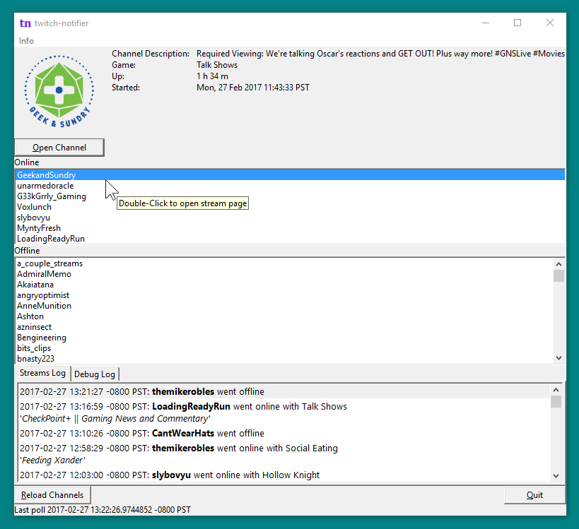

#  twitch-notifier-go
 

**desktop notifier for twitch streams**

[Visit my twitch-notifier blog for daily build downloads and more frequently updated info.
](https://twitch-notifier.blogspot.ca/)

Windows:  Mac / Linux: 

**twitch-notifier-go** is a golang port of my python twitch notifier.  Works on Windows; Works on Mac; Linux support in progress.

This is past the proof-of-concept stage, and is usable for getting notifications, but doesn't have all the features of my Python twitch-notifier yet, and is certainly a work in progress.

## Usage

Run the app, do the web login to Twitch when it comes up. You can then close the main window if you like and leave the app running to get notifications.  To bring the main window up again, double-click the system tray icon (Windows) or use the Show GUI menu item (Mac).

Unlike the python version, which has a username-only mode that looks at a user's public follows and doesn't require a login, twitch-notifier-go doesn't yet have a way around logging in or passing the OAuth token on the command line at the moment. 

## Future Plans

See [twitch-notifier-go black hole for tasks on Trello](https://trello.com/b/1kPOevw9/twitch-notifier-go-black-hole-for-tasks)

## Options

    -auth-oauth TOKEN   - OAuth token to use
        
## Acknowledgments

Uses code for accessing the Twitch API from [Fugi](https://github.com/fugiman)'s [Kaet](https://github.com/fugiman/kaet)

GUI uses [wxWidgets](https://www.wxwidgets.org/) and [Liu Shengqiu (dontpanic92)](https://github.com/dontpanic92)'s [wxGo](https://github.com/dontpanic92/wxGo) wrapper for it.

## Building from source

First, go to [https://golang.org/dl/](https://golang.org/dl/) and grab the Windows install of Go 1.7.x.

Then in theory you can do:

	go get github.com/rakslice/twitch-notifier-go/twitchnotifier

or something like that? But that probably won't work just yet.

So the old fashioned way to get up and running is to:

1. Follow the directions at [https://github.com/dontpanic92/wxGo](https://github.com/dontpanic92/wxGo) to get wxGo installed
2. Download the twitch-notifier-go source. If you're not reading this on github, and you don't have the source already, go get it at [github.com/rakslice/twitch-notifier-go](https://github.com/rakslice/twitch-notifier-go) 

5. Use the same environment as for wxGo to `go build twitchnotifier` 

